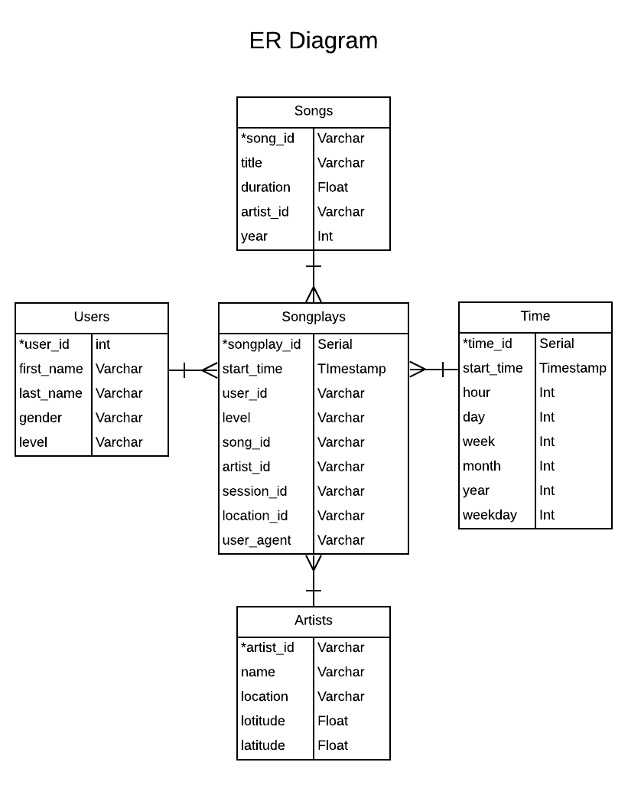

# Data Lake created on S3 with Apache Spark
In this project, I built an ETL pipeline for creating data lake hosted on S3. The ETL script loads data stored in JSON format in S3 using Spark, processes the data by doing necessary transformations and loads it into analytics tables serving as facts and dimensions tables using Spark. It saves the data frames into S3 in Parquet format to preserve schema of tables. The Parquet files in S3 are partitioned by appropriate attributes like year and month to facilitate quick retrieval of subset of data in the tables for future analysis by analytics and management teams.

## Analytics Requirement
A music streaming startup, Sparkify, has grown their user base and song database even more and want to move their data warehouse to a data lake. Their data resides in S3, in a directory of JSON logs on user activity on the app, as well as a directory with JSON metadata on the songs in their app.

The task is to build an ETL pipeline that extracts their data from S3, processes them using Spark, and loads the data back into S3 as a set of dimensional tables. This will allow their analytics team to continue finding insights in what songs their users are listening to.

## Solution
### Database Schema
I decided to model the database as star schema, which looks like the diagram shown below.

The `songplays` table is a facts table that contains information about the user activity of playing specific song at specific time. It references to other dimension tables like `users`, `songs`, `artists` and `time` through their IDs stored in `songplays` table as foreign keys.

### ETL pipeline
The datasets songs and log data about user activity stored in S3 as JSON files under separate directories are extracted and loaded in to Spark using its JSON reading capability. The Spark is  able to detect the schema of the datasets and read the data files into objects of class `pyspark.sql.DataFrame`. These data frames are able to carry out various SQL like operations on the underlying data stored in Spark cluster.

The dimension tables for `artists` and `songs` are created from the data frame in Spark created from songs dataset by selecting appropriate columns and renaming column names as appropriate to match the schema. Similarly the `users` and `time` tables are created from the data frame in Spark associated with user activity log dataset.

The timestamp attribute in the table of log dataset indicating when each activity was performed by user was originally present in milliseconds format in the table. The attribute is transformed into Python's `datetime` and added as new column `start_time` in the `songplays` table.

The `time` table is created from the timestamps of the user activity of playing next song and by extracting various attributes from the `datetime` derived from the timestamp i.e. hour, month, day of week, week of year, year etc.

The `songplays` facts table is created from the `songs` dimension table and `logs` table, created from original datasets, after loading them as temporary view tables in Spark and performing JOIN operation over attributes of the song i.e. ID, song's length and artist's name matching in both the tables. 

The prepared tables are saved back to S3 in Parquet format. The Parquet format allows to save the data frame in persistent storage while preserving the desired schema to be retrieved upon the files being read in future. Each table is appropriately partitioned based on specific attributes and saved across multiple directories in S3 to speed up the access of underlying data in future by analytics teams, in case they are only interested in loading and analysing small subset of the entire table based on some specific value of the attribute used for partition. 

Specifically, `songplays` table files are partitioned by `year` and `month` attributes when the user's activity was logged. `songs` table files are partitioned by `year` of song's release date and `artist_id` of artist who created the song. `time` table files are partitioned by `year` and `month` corresponding to the timestamp of activity when user starts playing new song.
 
After completion of ETL steps, the `etl.py` runs some sample query and counts rows in tables created and laoded as part of this ETL process. For e.g. the following is query is run against `users` table.
    
    users = spark.read.parquet(output_data + 'users.parquet')    
    users.registerTempTable("user_data")

    gender_paid_counts = spark.sql(
    """
    SELECT 
        COUNT(*) GENDER_COUNT,
        gender, 
        ROUND(AVG(CASE WHEN level = 'paid' THEN 1 ELSE 0 END), 2) PAID_FRACTION
    FROM user_data
    GROUP BY 2
    """).collect()
    table = PrettyTable(['Gender', 'Count', 'Paid_Fraction'])
    for row in gender_paid_counts:
        table.add_row([row.gender, row.GENDER_COUNT, row.PAID_FRACTION])
    print(table)
    
    Ouptut:
    +--------+-------+---------------+
    | Gender | Count | Paid Fraction |
    +--------+-------+---------------+
    |   F    |   55  |      0.27     |
    |   M    |   41  |      0.15     |
    +--------+-------+---------------+
    

Running this sample query after running ETL process on small test dataset of songs and log files stored in S3 generated the above output. The numbers will differ when running this query after running ETL process on actual large dataset of songs metadata and user activity log files stored in S3. [Here is the notebook](https://patelatharva.github.io/Data_Lake_with_Apache_Spark) that I created while working through and testing the steps performed in this `etl.py` on small test dataset. 

### How to run
The python scripts in this project are meant to be run by Python version 3+. Following commands are to be run after setting current directory of terminal to be project's directory.
To install the dependencies for the file, one can run:

    pip install -r requirements.txt

The credentials for AWS with appropriate permissions to read and write files from S3 are to be mentioned in `dl.cfg` file.

To perform the ETL steps for loading data from S3 into Spark, doing necessary transformations and loading database tables back into S3 as Parquet files, run following command:

    python etl.py
After the completion of the execution of this command, the dimensions tables like `songs`, `users`, `artists` and `time` and facts table `songplays` will be stored as Parquet file format in S3 under the directory specified in `etl.py`
